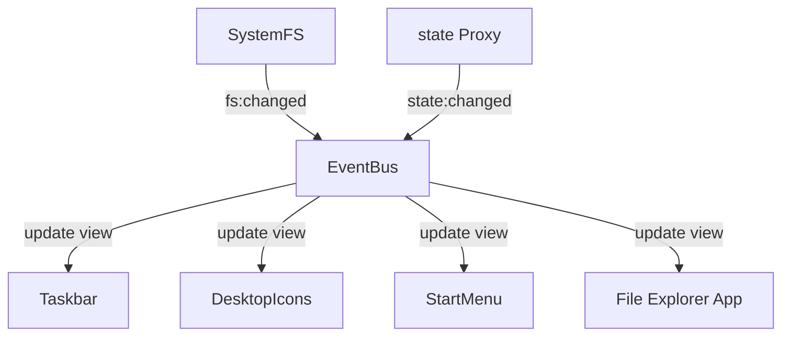

# PortfoliOS System Architecture

This document describes the modular architecture of PortfoliOS. The project is split into distinct layers to separate data (portfolio content), core services, and visual presentation shells (desktop, mobile, quick access).

---

## 1. Directory Structure

```
bl4ut0-portfolio-os/
├── core/                         # Core system services (EventBus, State, SystemFS, etc.)
├── data/                         # Portfolio content data arrays (systems, bookmarks, configurations)
├── desktop/                      # Desktop experience modules (shell, taskbar, start menu, etc.)
├── mobile/                       # Mobile experience modules (shell, app grid, nav bar)
├── quick/                        # Quick review view (shell)
├── apps/                         # Modular applications (files, webamp, doomsource, etc.)
├── styles/                       # Segmented styling sheets
└── index.html                    # Entry point HTML container
```

---

## 2. Key Components

### A. Core Layers (`/core`)
- **[event-bus.js](file:///c:/Dev Projects/bl4ut0-portfolio-os/core/event-bus.js)**: The nervous system of the OS. Publishes and subscribes to events (`app:opened`, `app:closed`, `fs:changed`, `view:changed`) to avoid direct, coupled render calls.
- **[state.js](file:///c:/Dev Projects/bl4ut0-portfolio-os/core/state.js)**: Global state object (`window.state`) wrapped in an ES6 Proxy. Intercepts writes and automatically fires EventBus state changed triggers.
- **[filesystem.js](file:///c:/Dev Projects/bl4ut0-portfolio-os/core/filesystem.js)**: Virtual File System (`SystemFS`) backed by IndexedDB. Includes an index on the `parent` field for fast directory traversal.
- **[storage.js](file:///c:/Dev Projects/bl4ut0-portfolio-os/core/storage.js)**: Clean unified interface for persistent (`localStorage`) and session (`sessionStorage`) storage.
- **[app-loader.js](file:///c:/Dev Projects/bl4ut0-portfolio-os/core/app-loader.js)**: Manages dynamic script/style loading for modular apps.

### B. Shared Data (`/data`)
- **[systems.js](file:///c:/Dev Projects/bl4ut0-portfolio-os/data/systems.js)**: Portfolio projects node definitions. Read by Dossier, Network Map, Mobile grid, and Quick views.
- **[apps.js](file:///c:/Dev Projects/bl4ut0-portfolio-os/data/apps.js)**: Desktop pinned app and store catalog definitions.
- **[config.js](file:///c:/Dev Projects/bl4ut0-portfolio-os/data/config.js)**: Static command configurations, routes, and wallpaper choices.

### C. Interface Shells
- **[desktop/shell.js](file:///c:/Dev Projects/bl4ut0-portfolio-os/desktop/shell.js)**: Orchestrates the Desktop view, event delegation, and bootstraps the system.
- **[mobile/shell.js](file:///c:/Dev Projects/bl4ut0-portfolio-os/mobile/shell.js)**: Orchestrates the touch-friendly mobile layout.
- **[quick/shell.js](file:///c:/Dev Projects/bl4ut0-portfolio-os/quick/shell.js)**: Orchestrates the rapid category list review layout.

---

## 3. Communication Patterns



- **Reactivity**: Change properties on `window.state` directly (e.g. `state.wallpaper = 'matrix'`). The Proxy in `state.js` intercepts this, updates the storage (if preference), and triggers EventBus event `state:changed:wallpaper`. Settings or shell scripts listen to this event and repaint elements.
- **Event-Driven File Updates**: Apps modifying virtual files call `SystemFS.writeFile(...)`. SystemFS emits `fs:changed` event. The File Explorer app listens to `fs:changed` and redraws the folder grid without visual flicker.
