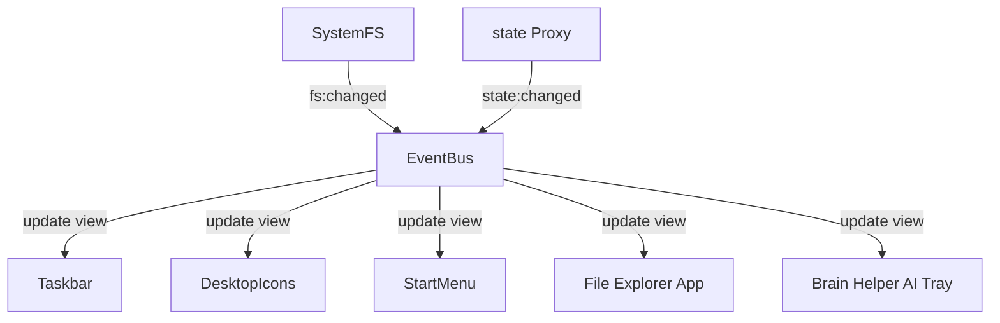

# PortfoliOS System Architecture

This document describes the modular architecture of PortfoliOS. The project is split into distinct layers to separate data (portfolio content), core services, modular applications, local AI processing, and visual presentation shells (desktop, mobile, quick access).

---

## 1. Directory Structure

```text
bl4ut0-portfolio-os/
├── core/                         # Core system services (EventBus, State, SystemFS, Local AI, App Framework, etc.)
├── data/                         # Portfolio content data arrays (systems, bookmarks, configurations, users)
├── desktop/                      # Desktop experience modules (shell, taskbar, start menu, brain helper, etc.)
├── mobile/                       # Mobile experience modules (shell, app grid, nav bar, mobile apps)
├── quick/                        # Quick review view (shell)
├── apps/                         # Modular applications (office, iptv, webamp, files, doomsource, etc.)
├── services/                     # Backend proxy services (ut99-relay Node.js service)
├── styles/                       # Segmented styling sheets
└── index.html                    # Entry point HTML container
```

---

## 2. Key Components

### A. Core Layers (`/core`)
- **[event-bus.js](core/event-bus.js)**: The nervous system of the OS. Publishes and subscribes to events (`app:opened`, `app:closed`, `fs:changed`, `view:changed`) to avoid direct, coupled render calls.
- **[state.js](core/state.js)**: Global state object (`window.state`) wrapped in an ES6 Proxy. Intercepts writes and automatically fires EventBus state changed triggers.
- **[filesystem.js](core/filesystem.js)**: Virtual File System (`SystemFS`) backed by IndexedDB. Includes an index on the `parent` field for fast directory traversal.
- **[storage.js](core/storage.js)**: Clean unified interface for persistent (`localStorage`) and session (`sessionStorage`) storage.
- **[app-framework.js](core/app-framework.js)**: Defines modular registration, window presets, lifecycle hooks, teardown, iframe messaging, and audio integration.
- **[app-loader.js](core/app-loader.js)**: Lazily loads modular app scripts/styles and exposes retryable validation failures.
- **[local-ai.js](core/local-ai.js)**: Manages browser-local WebGPU/WebLLM models, prompt templates, and fallback Gemini cloud AI routing.
- **[simple-brain.js](core/simple-brain.js)**: Defines single-turn AI skill execution, prompt injection, and rule-based assistant routines.
- **[gdrive-sync.js](core/gdrive-sync.js)**: Centralized cloud synchronization engine for user SystemFS file backups to Google Drive.
- **[preferences.js](core/preferences.js)**: Profile-scoped user preferences, volume state propagation, and settings persistence.

### B. Shared Data (`/data`)
- **[systems.js](data/systems.js)**: Portfolio projects node definitions. Read by Dossier, Network Map, Mobile grid, and Quick views.
- **[apps.js](data/apps.js)**: Desktop and Store catalogs. Entries marked `modular: true` are the single source for the lazy-loader's app list.
- **[users.js](data/users.js)**: User profiles, preference scoping, and Cloud AI authorization policies.
- **[config.js](data/config.js)**: Static command configurations, routes, and wallpaper choices.

### C. Modular Applications (`/apps`)
- **[office](apps/office)**: Rich document editor with IndexedDB persistence, document formatting, and cloud backup hooks.
- **[iptv](apps/iptv)**: Live IPTV streaming player with HLS.js and mpegts.js decoders.
- **[webamp](apps/webamp)**: Cleanly mounted Winamp/Webamp audio player in desktop window framing.
- **[files](apps/files)**: Virtual File Explorer browsing `SystemFS` directories and `/Saved Games`.
- **[taskmgr](apps/taskmgr)**: System Task Manager monitoring running processes, windows, memory, and performance.
- **[ut99](apps/ut99)**: Unreal Tournament 99 WebAssembly runtime launcher and server browser.
- **[doomsource](apps/doomsource)** & **[openrct2](apps/openrct2)**: WebAssembly game ports integrated into the iframe game framework.

### D. Interface Shells
- **[desktop/shell.js](desktop/shell.js)**: Orchestrates the Desktop view, event delegation, start menu launcher, and system bootstrap.
- **[desktop/brain-helper.js](desktop/brain-helper.js)**: System tray AI assistant panel, model selector, and streaming response UI.
- **[mobile/shell.js](mobile/shell.js)**: Orchestrates the touch-friendly mobile layout, swipe gestures, status shade, and lock screen.
- **[mobile/apps/](mobile/apps)**: Mobile-optimized apps (Music, Settings, Survival AI, Warden IT, Status).
- **[quick/shell.js](quick/shell.js)**: Orchestrates the rapid category list review layout.

### E. Backend Services (`/services`)
- **[ut99-relay](services/ut99-relay)**: Standalone Node.js WebSocket-to-UDP proxy relay server for web multiplayer sessions.

---

## 3. Communication Patterns


```mermaid
graph TD
    FS[SystemFS] -->|fs:changed| EB[EventBus]
    State[state Proxy] -->|state:changed| EB
    EB -->|update view| Taskbar[Taskbar]
    EB -->|update view| DesktopIcons[DesktopIcons]
    EB -->|update view| StartMenu[StartMenu]
    EB -->|update view| FilesApp[File Explorer App]
    EB -->|update view| BrainTray[Brain Helper AI Tray]
```

- **Reactivity**: Change properties on `window.state` directly (e.g. `state.wallpaper = 'matrix'`). The Proxy in `state.js` intercepts this, updates the storage (if preference), and triggers EventBus event `state:changed:wallpaper`. Settings or shell scripts listen to this event and repaint elements.
- **Event-Driven File Updates**: Apps modifying virtual files call `SystemFS.writeFile(...)`. SystemFS emits `fs:changed` event. The File Explorer app listens to `fs:changed` and redraws the folder grid without visual flicker.
- **Local AI & Skills Engine**: User requests target `core/local-ai.js` or `core/simple-brain.js`. WebGPU execution streams tokens to `desktop/brain-helper.js` or `desktop/terminal.js` UI components.

