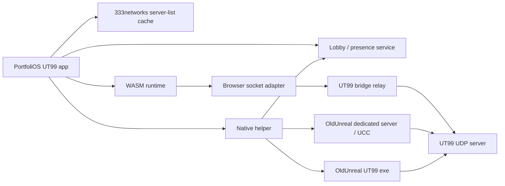

# UT99 OldUnreal Browser/Native Bridge

## Goal

PortfoliOS should present Unreal Tournament 99 as one multiplayer experience across:

- the native OldUnreal-patched executable,
- the browser WASM flyby/runtime,
- public UT99 server lists,
- PortfoliOS presence/status surfaces,
- LAN/self-hosted games advertised through PortfoliOS.

The native OldUnreal install remains the authoritative multiplayer path. The browser runtime can be embedded as a demo first, then bridged through a web-safe networking layer once we control or rebuild the WASM socket path.

## Current Constraints

- OldUnreal 469+ is the supported native UT99 path for real multiplayer.
- Browsers cannot open raw UDP sockets to UT99 servers.
- The icculus WASM build loads and caches UT99 data in-browser, but its shell does not expose a multiplayer proxy configuration.
- `utwasm-mgen` is a manifest generator for packaging game data around the icculus Emscripten build; it is not a multiplayer bridge.
- A normal static/PHP web host cannot relay live UT99 traffic by itself. Gameplay relay needs a long-running process with WebSocket/WebTransport and UDP socket access.

## Architecture



## Components

### PortfoliOS UT99 App

Responsibilities:

- show public UT99 servers via a cached 333networks/UT99.org feed,
- show PortfoliOS users who are browsing, playing, hosting, or relaying,
- expose actions: Play WASM demo, Install OldUnreal, Join Native, Host LAN, Host Relay,
- provide attribution for 333networks data,
- never poll public server-list APIs faster than their published refresh cadence.

### Native Helper

Small local companion app for Windows first.

Responsibilities:

- detect OldUnreal/UT99 install path,
- install/register a custom protocol handler such as `portfolios-ut99://join?...`,
- launch `UnrealTournament.exe` or the OldUnreal executable with a server target,
- start/stop a dedicated server where configured,
- query local server status over UT99 query ports,
- heartbeat LAN/self-hosted sessions to PortfoliOS.

The helper is required for LAN discovery and native join flows because the browser cannot inspect local processes or open UT99 UDP sockets directly.

### Bridge Relay

Long-running backend service. Node, Go, or Rust are better fits than PHP.

Responsibilities:

- accept browser WebSocket/WebTransport connections,
- allocate relay sessions,
- open UDP sockets toward the selected UT99 server,
- forward datagrams between browser client and UT99 server,
- enforce auth/rate limits/session timeouts,
- report relay health and player/session state to PortfoliOS.

The first scaffold lives in `services/ut99-relay`. It is a WebSocket-to-UDP relay that intentionally requires origin allowlisting, target allowlisting, short-lived HMAC tokens, session TTLs, idle timeouts, payload caps, and byte-rate limits.

Initial protocol shape:

```json
{
  "type": "ut99.relay.open",
  "targetHost": "203.0.113.10",
  "targetPort": 7777,
  "clientId": "profile-or-guest-id",
  "transport": "websocket-datagram"
}
```

Binary WebSocket frames should carry UDP payloads after the relay session is established. JSON frames should be reserved for control messages, errors, and status.

### WASM Runtime Adapter

The existing icculus WASM runtime can be embedded for flyby/demo first. Real multiplayer requires one of these:

1. Rebuild the WASM runtime with an Emscripten-compatible WebSocket socket/proxy path.
2. Patch/shim the runtime networking calls into a browser-side adapter.
3. Build a custom Unreal/IpDrv net driver for WebSocket/WebRTC.

Option 1 is the most practical first research target. Without this, the WASM runtime cannot transparently join normal UT99 UDP servers.

## Milestones

1. **UT99 App Shell**
   - Add Store app entry.
   - Add server browser using cached 333networks data.
   - Add "Install OldUnreal" and "Play WASM Flyby" actions.

2. **Native Multiplayer Helper**
   - Detect OldUnreal installation.
   - Register PortfoliOS join protocol.
   - Launch native client into selected server.
   - Report presence back to PortfoliOS.

3. **LAN Host Advertising**
   - Helper detects or starts a local dedicated server.
   - Helper posts session heartbeat to PortfoliOS.
   - PortfoliOS shows LAN/self-hosted sessions separately from public 333networks servers.

4. **Relay Prototype**
   - Deploy a backend relay with WebSocket in and UDP out.
   - Verify traffic with a controlled OldUnreal dedicated server.
   - Add relay status to PortfoliOS debug/status surfaces.

5. **WASM Multiplayer Research**
   - Mirror the icculus flyby runtime for a controlled test.
   - Rebuild or adapt the WASM socket layer.
   - Attempt join against the controlled relay server.

## Non-Goals For First Pass

- Browser client joining arbitrary UT99 UDP servers directly.
- Mirroring full commercial game installers through PortfoliOS.
- Replacing OldUnreal's native client/server stack.
- Shipping a browser multiplayer client before relay and runtime adapter tests pass.

## Security And Legal Notes

- Link to OldUnreal full installers/releases instead of redistributing installers from PortfoliOS.
- Do not bundle full UT99 commercial assets in the repo.
- Treat relay traffic as untrusted binary data.
- Rate-limit server-list, query, and relay endpoints.
- Expire relay sessions aggressively when browser clients disconnect.

## Recommended First Implementation

Build the Store app and server browser first, then the helper. This gives PortfoliOS a useful UT99 multiplayer surface immediately while the WASM networking bridge remains an isolated R&D track.
